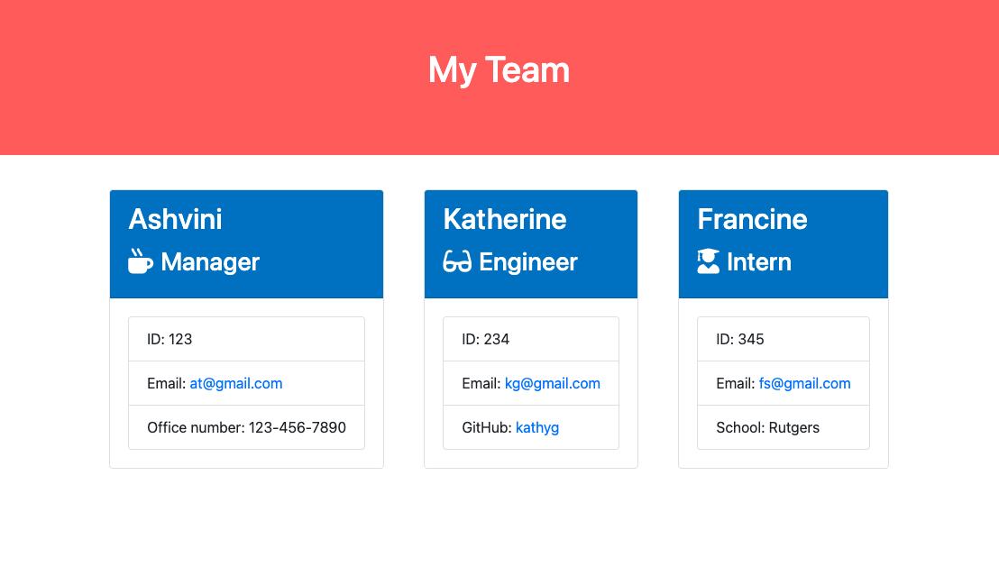
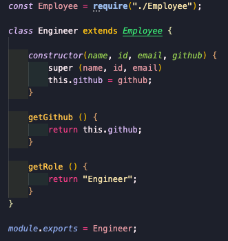
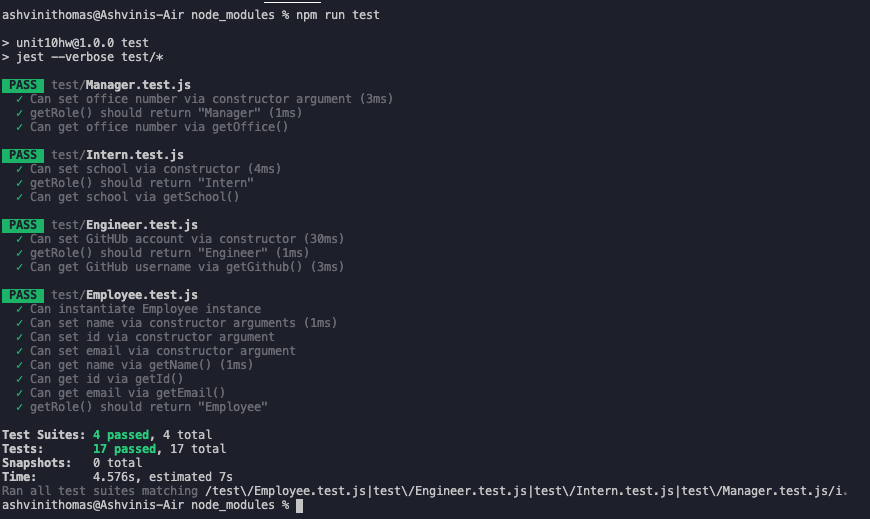
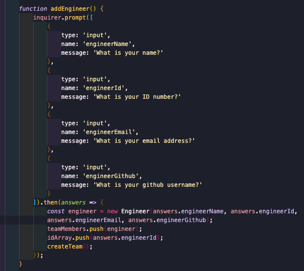
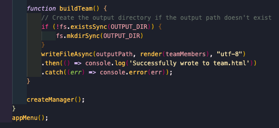

# teamProfileGenerator

This Team Profile Generator was created for a manager to generate a webpage that displays their team's basic information.

1. Created code to define and export classes that were inherted from the Employee class

    

2. Ran tests to create and update classes to pass a single test case

    

3. Created objects of questions for classes, a variable to store the object instantiated with the class, passing answers properties as input arguments to the class constructor and pushed cariable and class id to the respective arrays

    

4. Created file in directory

    
    

